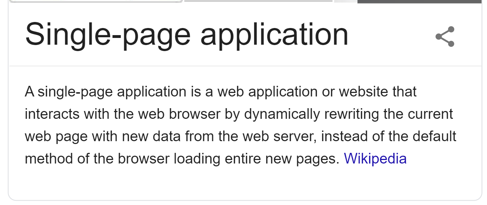
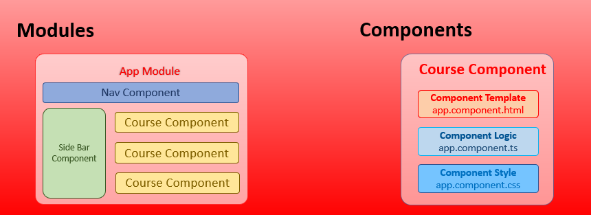

# 01 - Introduction

## SPA



## Angular Introduction

- Angular is a front-end web application development framework that is used to develop Single Page web Applications.
- It is a free and Open Source framework maintained by Google
- Versions
  - Angular JS - 2010
  - Angular 2 - 2016
  - Angular 4 - 2017
  - Angular 5 - November 2017
  - Angular 6 - March 2018
  - Angular 7 - October 2018
  - Angular 8 - May 2019
- Prerequisites

<!--
- HTML, CSS, JS
- TypeScript
-->

### Features

- Speed and Performance
- Smaller Application
- Modular Application Development
- Use TypeScript
- Single Page Application(SPA)

<!-- ### Others

- Version Semantic - [https://docs.npmjs.com/about-semantic-versioning](https://docs.npmjs.com/about-semantic-versioning)
- Release Cycle - [https://angular.io/guide/releases](https://angular.io/guide/releases) -->

### Starting a new App

```js
// Angular CLI Installation
npm install -g @angular/cli
ng v

ng new APP_NAME
cd APP_NAME
ng serve -o
ng serve --host 0.0.0.0 // ==> to run local server for the network
```

- to find the ip address run `ipconfig` in cmd

- Architecture - Module and Component Based



- [Folder Structure](https://angular.io/guide/file-structure)
- Termonology
  - Modules - container for the Components and Services
  - Components - Container for template, data and logic
  - Controller(component) - `*.component.ts` file
  - Template(view) - `*.component.html` file
- Generate Commands

```cmd
ng g module MODULE_NAME

ng g c COMPONENT_NAME
ng g c MODULE_NAME/COMPONENT_NAME

ng g service myservice
```

### `@NgModule` decorator

- declarations - contain Components, Pipes, Directives
- imports - contain modules
- providers - contain services
- bootstrap - contain the root components

```ts
@NgModule({
  declarations: [
    AppComponent
  ],
  imports: [
    BrowserModule
  ],
  providers: [],
  bootstrap: [AppComponent]
})
```

### `@Component` decorator

- selector
- template
- templateUrl
- styleUrls
- styles

```ts
@Component({
  selector: "app-root",
  template: `
    <h1>Hello World</h1>
  `,
  styles: [`h1 { color: red;}`]
})
```

```ts
@Component({
  selector: "app-root",
   templateUrl: "./app.component.html",
   styleUrls: ["./app.component.css"]
})
```

- Interpolation

```ts
// app.component.ts
export class AppComponent {
  title = "Angular App";
}
```

```html
<!-- app.compoent.html -->
<h1>{{title}}</h1>
<p>{{13 + 12}}</p>
```

- Event Binding

```ts
// app.component.ts
export class AppComponent {
  count = 0;

  changeData() {
    this.count += 1;
  }
}
```

```html
<!-- app.component.html -->
<h1>{{count}}</h1>
<button (click)="changeData()">Change Content</button>
```

### Using Bootstrap

- Methods of Using Bootstrap
  - Using CDN
  - By Downloading
  - By Installing
- By Downloading - download Bootstrap CSS library from its official website and copy the `bootstrap.min.css` file and paste in into your Angular app (under src) it in styles array of Angular-cli.json of app like :

```json
"styles": [
  "src/styles.css",
  "bootstrap.min.css"
],
```

- By Installing Bootstrap module using npm command.

```cmd
npm i bootstrap
```

- To verify if the ng-bootstrap module is installed on your machine, go to package.json file of your app and check Bootstrap module.
- Now add the following code in the style of the `angular.json`

  ```json
  "styles": [
    "src/styles.css",
    "../node_modules/bootstrap/dist/css/bootstrap.min.css",
  ],
  ```

  <!-- "/node_modules/bootstrap/dist/css/bootstrap.min.css" -->

### Using jQuery

```js
// npm install jquery
// Add the jquery path to the angular.json scripts property
{
  // ...
  "scripts": ["./node_modules/jquery/dist/jquery.min.js"]
  // ...
}
// RE RUN the app : ng serve
```

<!-- NOTE: While using Bootstrap and jquery first add the jquery .js file and bootstrap .js file -->

```html
<!-- app.component.html -->
<div>This is To Animated</div>
<button>Animate</button>
```

```ts
// app.component.ts
declare var $: any;

// app.component.ts
ngOnInit() {
  $(document).ready(() => {
    $('button').click(() => {
      $("div").animate({ left: '100px' }, "slow")
      $("div").animate({ fontSize: '5em' }, "slow")
    })
  })
}
```
