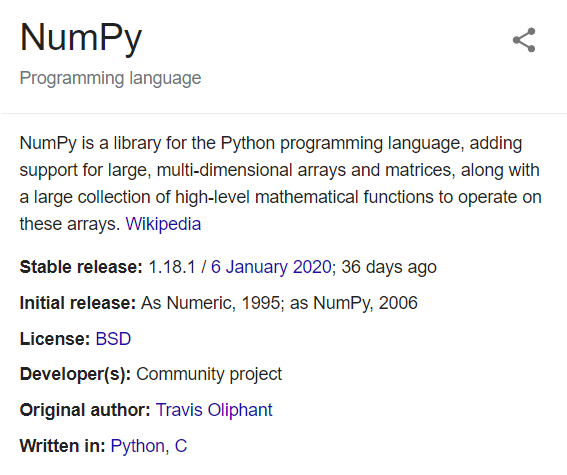

# Numpy



- **Installation**: `pip install numpy`
- [https://numpy.org](https://numpy.org)

## Methods

- np.array()
- np.arange()
  - np.arange(0, 30, 5)  # Create a sequence of integers from 0 to 30 with steps of 5
- np.zeros()
- np.ones() - Create a 3X4 array with all zeros
- np.empty() - creates an array whose initial content is random and depends on the state of the memory
- np.linspace(start, stop, count)
  - np.linspace(0, 5, 10)
    - Create a sequence of 10 values in range 0 to 5
- np.array.
  - .reshape() - return the reshaped array
  - .resize() - change the array itself
  - .ndim - find the dimension of the array
  - .shape - find the shape of the array(no. of the coloumn and the no. of the rows)
  - .shape = (shape)
  - .dtype -  find the data type of the element
  - .dtype.name
  - .size - no. of the elements in the array
  - .itemsize - find the byte size of each element
  - dtype=
    - np.int32
    - np.float
- np.sum() - axis=0,1 - do sum of array elements
- np.add(x1, x2, out)
  - used to add two or more arrays
  - x1, x2 - two arrays
  - out - array to save the result
- np.min()
- np.max()
- np.sqrt()
- np.info(np.min) - to see the information about the method
<!-- - np.exp() -->

## Indexing, Slicing, Iterating

- 1 - Dimension
  - indexing and slicing same as normal list
- 2 - Dimension
  - [1, 2]
  - [1:, 2]
  - x[1,2,...] is equivalent to x[1,2,:,:,:],
  - x[...,3] to x[:,:,:,:,3] and
  - x[4,...,5,:] to x[4,:,:,5,:]
- properties and methods of numpy.ndarray
  - .flat
  - .ravel() - return the flattern array
  - .T - return the transpose

## Create

```py
import numpy as np

# creating a numpy array
np.array([1, 2, 3])
np.array([1, 2, 3], dtype="float")
np.array([1, 2, 3], dtype=complex)
np.array([1, 2, 3], dtype="complex")
np.array([[1, 2, 3], [4, 5, 6], [12, 13, 14]])
np.array((1, 3, 2))
[[1, 2, 3], [4, 5, 6]]
np.array("hello")
np.array(("hello"))
np.array(("hello", "hello2"))
np.array([("hello", "hello2"), ("hello3", "hello4")])
np.array([12, "hello"])

a = np.array([(1, 2, 3), (4, 5, 6000088883838380)], dtype=np.int64)

np.array([1.2, 1.3, 1.4], dtype=int)

np.arange(15).reshape(3, 5)
np.arange(15, dtype="float").reshape(3, 5)

np.array([[1, 2, 4], [5, 8, 7]])
np.full((3, 3), 6, dtype="complex")  # Create a constant value array of complex type
np.random.random((2, 2))  # Create an array with random values


# Reshaping 3X4 array to 2X2X3 array
a = np.array([[1, 2, 3, 4], [5, 2, 4, 2], [1, 2, 0, 1]])

print(a.reshape(2, 2, 3))
print(a.reshape(2, 3, 2))
a.resize(4, 4)
a.resize(1, 2)
a.resize(2, 3)


np.arange(6)  # 1d array
np.arange(12).reshape(4, 3)  # 2d array
np.arange(24).reshape(2, 3, 4)  # 3d array
np.arange(24).reshape(2, 3, 2, 2)  # 4d array
# np.set_printoptions(threshold=100)
```

## Features

```py
import numpy as np
import sys
import time

# FEATURE of numpy
# 1 - less size than list
# a = list(range(1000))
# print(sys.getsizeof(2) * len(a))

# a = np.arange(1000)
# print(a.size * a.itemsize)


# # # 2 - faster
s = 1000000
L1 = list(range(s))
L2 = list(range(s))

A1 = np.arange(s)
A2 = np.arange(s)

start = time.time()
res = [(x, y) for x, y in zip(L1, L2)]
print((time.time() - start) * 1000)

start = time.time()
res = A1 + A2
print((time.time() - start) * 1000)
```

## Methods Example

```py
import numpy as np

# max, min ,sum
a = np.array([1, 2, 3])
print(a.max())
print(a.min())
print(a.sum())
a = np.array([(1, 2, 3), (4, 5, 6)])
print(a.sum(axis=0))  # y axis addition
print(a.sum(axis=1))  # z axis addition

# suqare root
a = np.array([(1, 2, 3), (4, 5, 6)])
print(np.sqrt(a))

# standard deviation
a = np.array([(1, 2, 3), (4, 5, 6)])
print(np.std(a))


# stacking
a = np.array([(1, 2, 3), (4, 5, 6)])
b = np.array([(1, 2, 3), (4, 5, 6)])
print(np.vstack((a, b)))
print(np.hstack((a, b)))


# NOTE difference between the ravel and flattern
a = np.array([(1, 2, 3), (4, 5, 6)])
a.ravel() # convert to one row
a = np.array([[1, 2, 3], [4, 5, 6]])
a.flatten() # Flatten array

# Unary operation
# Special Functions - cosine, sine

# Universal Functions
# NumPy provides familiar mathematical functions such as sin, cos, and exp. In NumPy, these are called “universal functions”(ufunc). Within NumPy, these functions operate elementwise on an array, producing an array as output

a = np.array([1, 2, 3])
b = np.array([4, 5, 6])

print(np.add(a, b))
print(np.exp(a))


def f(x, y):
    return 10 * x + y


b = np.fromfunction(f, (5, 4), dtype=int)  # (function, shape)
print(b)
print(b[2, 3])
print(b[0:5, 1])
print(b[:, 1])
print(b[1:3, :])
print(b[-1])


c = np.array([[[0, 1, 2], [10, 12, 13]], [[100, 101, 102], [110, 112, 113]]])
print(c.shape)
print(c[1, ...])  # same as c[1,:,:] or c[1]
print(c[..., 2])  # same as c[:,:,2]

for row in c:
    print(row)

# Shape Manipulation
a = np.floor(10 * np.random.random((3, 4)))
print(a)
print(a.shape)
print(a.ravel())  # returns the array, flattened
print(a.reshape(6, 2))  # returns the array with a modified shape
print(a.T)  # returns the array, transposed
print(a.T.shape)
print(a.shape)


a = np.arange(15).reshape(3,5)

for i in a.flat:
    print(i)
```

## Operators

```py
import numpy as np


# slicing - 1D, 2D
a = np.array([(12, 13, 14), (14, 15, 16), (17, 18, 19)])
print(a)
print(a[0, 2])
print(a[0:, 2])
print(a[0:2, 2])

# + - * /
a = np.array([(1, 2, 3), (4, 5, 6)])
b = np.array([(1, 2, 3), (4, 5, 6)])

print(a + b)
print(a + 4)
print(a - b)
print(a * b)
print(a / b)

a = np.array([1, 2, 3, 4, 5])
print(a > 1)

a = np.array([[1, 2], [3, 4]])
b = np.array([[2, 3], [4, 4]])
print(a * b)  # elememt wize product
# Matrix product
print(a @ b)
print(a.dot(b))

# Compound Assignment operation also possible
# +=, -=, etc
```

## Other Functions

```py
# np.fromfunction()
np.fromfunction(lambda x, y: y+x, (3, 3), dtype=int)


# np.random
# np.random.randint()
np.random.randn(3)
np.random.random((2,2))


b = np.hstack((a,a,a))
np.vstack((a,a,a))

np.hsplit(b, 9)
np.vsplit(b, 9)


# Copy and Views
a = np.arange(10)

b = a
a.resize(5,2) # change happen in both a and b

# in python mutable objects are passed as references

## View or Shallow Copy

# While slicing a array  a view of it is returned
#  view method creates a new array object that looks at the same data.
c = a.view() # create a new copy of the array

a == c

a is c
a is b

c.shape = 2,5
a

# Deep copy - copy method makes a complete copy of the array and its data
d = a.copy()
d is a

c.base is a
d.base is a

d[0,0] = 111

c[0,0] = 222
a

# we can omit one of the sizes which will then be deduced automatically
np.arange(10).reshape(2,-1) # -1 means "whatever is needed"
```
