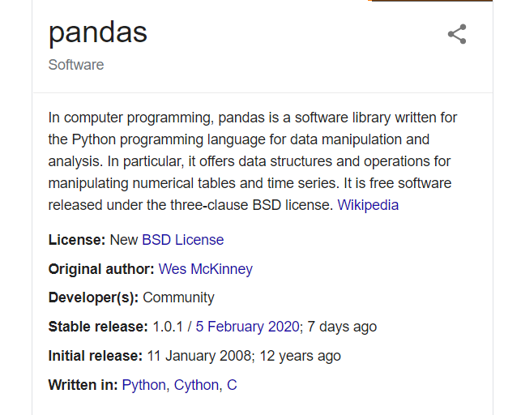

# Pandas



## Usecase

- Data analysis
- It can be used to read the data from the JSON file, HTML file, Clipboard, Database, etc.
- Handling Missing Data

## Pandas Data Structure

- series - 1 D, homogeneous data, size immutable, value of data mutable
- dataframe - 2 D, Heterogeneous, size mutable, data mutable
- Panel - 3D, Heterogenous, size mutable, data mutable

## Pandas Operations

- Slicing the Dataframe
- Changing the Index
- Data conversion
- Joining and Merging
- Concatenation
- Changing the Coloumn headers

## Example

```py
import pandas as pd

a = pd.Series([1,2,3,4,'hgg'])

type(a)
dir(a)
a.dtype
a.dtypes

b = pd.DataFrame({'A': [1,2,3,4], 'B': [11,22,33,44]})
type(b)
b.dtypes

pd.date_range('111', periods=6)
dates = pd.date_range(start='13/1/2019',end='12/2/2019', periods=6)
dates = pd.date_range(start='13/1/2019', periods=6)

import numpy as np

df = pd.DataFrame(np.random.randn(6,4),index=dates, columns=list('ABCD'))


df = pd.DataFrame({
    'A': [1,2,3],
    2: ['A', 'B','C'],
    3: [1,2,'A']
}, index=[2,3,4,1])

a.dtype
a.dtypes

a.to_numpy()


# pd.Series()
# pd.DataFrame()
# pd.date_rane()

# Series()
#   - dtype
#   - dtypes
#   - .to_numpy()


# DataFrame()
#   - .dtypes
#   - .to_numpy()
#   - columns=
#   - index=
#   - .describe()
#   - .head()
#   - .tail()
#   - .T


df.tail(1)
df.sort_index()
df.sort_index( ascending=False)

df.columns
df.index

# Selection
type(df.A)
df.A
df['A']

df.plot()
```
